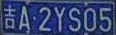

# 车牌定位功能
| 模型               | 使用技术              | 效果 | 是否完成 |
| ------------------ | --------------------- | ---- | -------- |
| **python3-opencv** | **传统数字图像处理**  | 一般 | 是       |
| **YOLOv3**         | **神经网络+迁移学习** | 良好 | 是       |
| **Mask-RCNN**      | **神经网络+迁移学习** | 较好 | 是       |

**效果排序(从高到底): Mask-RCNN > YOLOv3 > python3-opencv** 

## 数据来源 

**本项目使用的数据集为246张中文车牌数据集, 数据来源**:https://gitee.com/easypr/EasyPR/tree/master/resources/image/general_test

## 其他数据来源

中文车牌数据 https://github.com/airxiechao/simple-car-plate-recognition

英文车牌数据 http://www.medialab.ntua.gr/research/LPRdatabase.html

**数据标注工具**: 

**labelImg 项目地址**:https://github.com/tzutalin/labelImg

**win10+anaconda**安装教程:

```python
conda create -n labelmg python=3.6
conda activate labelmg
conda install pyqt=5
pyrcc5 -o libs/resources.py resources.qrc
python labelImg.py
```

**VGG Image Annotator VIA**:http://www.robots.ox.ac.uk/~vgg/software/via/

## 项目介绍

**本项目将以下提供三种模型可以对车牌进行定位**

1. 使用传统数字图像处理技术(Python-Opencv)，通过图像去噪->图像增强->二值化->边缘检测->图像提取分割。具体说明为:

   1. 对于图像预处理，简单的使用高斯模糊来降低噪音和使用自适应直方图均衡化处理
   2. 对于图像增强处理，使用开操作加权强化对比度。
   3. 边缘检测使用Canny算法
   4. 图像提取怎使用先闭后开操作分割为几块图像
   5. 在寻找车牌在整体图像位置的时候，通过限制边缘检测后分块的面积大小和高度和宽度比来去除不符合要求的图像块。
   6. 使用仿射变化将图片摆正，可以在一定程度上减少因为拍摄角度而带来的图像问题，
   7. 最后我们显示并保存切割图片

   <div align=center></br>
   <div align=center>

2. 使用已经训练COO数据的目标检测模型(**Object Detection:YOLOv3**)，做迁移学习，对已经训练过COCO数据的模型卷积层权重参数进行微调，从而得到车牌定位功能的新模型。效果如下:

   <div align=center>
   <div align=center>

3. 使用已经训练实例分割气球模型(**Instance Segmentation:Mask R-CNN**)，做迁移学习，对已经训练过COCO数据模型参数进行微调，从而得到车牌定位功能的新模型。模型介绍: https://engineering.matterport.com/splash-of-color-instance-segmentation-with-mask-r-cnn-and-tensorflow-7c761e238b46

   <div align=center>
   <div align=center>

## 传统数字图像处理方法

1. 该模型代码可以在window和linux环境下正常运行

2. 使用opencv>=3.4的python3接口完成程序结构

3. 模型运行所需类库见PythonOpencv\requirements.txt,我们使用anaconda虚拟环境,执行下列命令即可完成安装所需类库

   ```anaconda
   conda install --yes --file requirements.txt
   ```

4. 模型为程序:PythonOpencv\position.py

## 目标检测模型 ---YOLOv3

1. 该项目是在colab环境下训练测试,本身为linux环境,对于模型windows下部署可以参考链接: [https://www.zhezhi.press/2019/10/17/win10-vs2019-%E9%85%8D%E7%BD%AEdarknet-yolov3/](https://www.zhezhi.press/2019/10/17/win10-vs2019-配置darknet-yolov3/) 这里使用darknet而不使用tf或portch,因为穷(darknet执行效率和精度都要高),就这都是白嫖colab的gpu.

2. 需要安装的Yolov3模型框架，模型原项目地址:https://github.com/AlexeyAB/darknet (这里选择使用这个版本是为了兼容window平台)可按照其步骤进行安装。

3. 该项目和代码使用Google的Colab提供免费GPU运行

4. 本项目使用数据格式采用Yolov3数据格式，可以通过项目的transform对 VIA标注图片结果via_region_data.json进行转化,转化好的所需数据集为 obj.zip  obj.name obj.data

5. YOLOv3 在COCO数据集训练卷积层权重参数文件 darknet53.conv.74 可以将其放在Goole Drive根目录下下载: http://pjreddie.com/media/files/darknet53.conv.74

6. 该项目配置时候需要设置Google的Drive和colab路径，在Google Drive中的建立Yolo3文件夹，并在Yolo3文件夹中放入所需要的数据（obj.zip  obj.name obj.data Yolov3配置文件yolov3_custom2.cfg 分割训练数据文件generate_train.py ）以及建立backup文件夹(有用保存模型训练时候权重参数).---这里所需文件会提供

7. 该车牌定位YOLOv3模型训练的权重结果在:https://drive.google.com/file/d/1--Kmf45XzvjNPnrBXeVkunZolRn-N6J9/view?usp=sharing

8. 模型所需数据和配置文件在:YOLOv3/yolo3

9. 模型主要代码为:**licensePlateLocation.ipynb**

10. 模型所需数据格式转为:transform.py

11. 根据模型的结果来切割图片得到车牌代码:crop.py

12. **这里模型本身是只在图上圈出目标物体,并没有输出检测边框的大小,这里我是修改其源代码可以达到结果,替换其darknet/src/image.c文件，这里我们提供文件新的image.c文件,重新编译后,会在darknet所在的目录产生一个BoxValue.txt文件。修改的文件为darknet\image.c中的draw_detections_v3函数，一共修改三个地方，分别加入**

    ```c
    //创建保存位置信息txt文档
    FILE *fp;
    if ((fp = fopen("BoxValue.txt", "w+")) == NULL) {
    printf("创建文档失败:\n");
    }
    
    //输出坐标信息到文本文件
    fprintf(fp, "左部边框的位置：%d 顶部边框的位置：%d 右部边框的位置：%d 底部边框的位置：%d\n", left, top, right, bot);
    
    //关闭坐标文本文件
    fclose(fp);
    ```

    ​	    

    <div align=center></br>
    <div align=center></br>
    <div align=center>

13. 根据我们得到的BoxValue.txt文件内容，可以使用crop.py文件对图像进行切割，得到cv_cut_thor.jpg切割的车牌

## 实例分割气球模型---Mask R-CNN

1. 该项目是在colab环境下训练测试,如果使用windows平台部署，可以安装所需类库见MaskRCNN\requirements.txt,**执行模型**具体使用代码详细见MaskRCNN\carPlateLocation.py

   我们使用anaconda虚拟环境,执行下列命令即可完成安装所需类库

   ```anaconda
   conda install --yes --file requirements.txt
   ```

2. 需要下载的Mask R-CNN模型框架，模型原项目地址:https://github.com/matterport/Mask_RCNN 可按照其步骤进行安装所需要类库

3. 该项目和代码使用Google的Colab提供免费GPU运行。

4. 这里注意因为Google的Colab提供tf和keras环境都已经升级到2.x了,如果直接在colab上运行会报版本的错误。我们需要通过命令 **%tensorflow_version 1.4** 在引入tf框架前加上，来限制tf的版本，通过 **! pip install q keras==2.1**命令在引入keras前来限制kears版本。

5. 本项目使用数据格式采用VIA方式标注图片结果。

6. 该项目配置时候需要设置Google的Drive和colab路径，在Google Drive中的建立Mask_RCNN文件夹和dataset文件夹，在Mask_RCNN文件夹下加入模型训练和检验文件inspect_carplate_model.ipynb和经过COCO数据训练权重系数mask_rcnn_coco.5(https://github.com/matterport/Mask_RCNN/releases) ,在dataset文件下放入所需数据carplate.zip (https://github.com/airxiechao/simple-car-plate-recognition/blob/master/dataset/carplate.zip) ，在Colab Notebooks中放入mrcnn文件夹(这里在原项目mrcnn中加入caplate.py文件)--- 这里所需文件会提供

7. 该车牌定位Mask R-CNN模型训练的权重结果在:https://drive.google.com/file/d/110PH2IwIwRg94equVqor-Ip8sR1fD760/view?usp=sharing

8. 模型主要代码为:**Mask-RCNN/licensePlateLocation.ipynb**

9. 模型所需的功能代码为Colab Notebook\mrcnn

10. 该模型所需数据集为dataset文件夹(这里根据上面提供网上进行下载)

11. 模型检验代码detectionTest.py


​				

