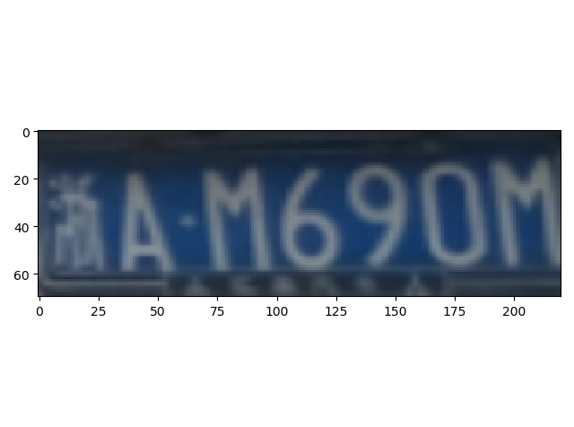

# 车牌定位功能
## 数据来源 

**本项目使用的数据集为246张中文车牌数据集, 数据来源**:https://gitee.com/easypr/EasyPR/tree/master/resources/image/general_test

**数据标注工具**: 

**labelImg 项目地址**:https://github.com/tzutalin/labelImg

**VGG Image Annotator VIA**:http://www.robots.ox.ac.uk/~vgg/software/via/

## 项目介绍

**本项目将以下提供三种模型可以对车牌进行定位**

1. 使用传统数字图像处理技术(Python-Opencv)，通过图像预处理->图像增强->二值化->边缘检测->图像提取分割

2. 使用已经训练COO数据的目标检测模型(**Object Detection:YOLOv3**)，做迁移学习，对已经训练过COCO数据的模型卷积层权重参数进行微调，从而得到车牌定位功能的新模型。效果如下:

   <div align=center>
   <div align=center>

3. 使用已经训练实例分割气球模型(**Instance Segmentation:Mask R-CNN**)，做迁移学习，对已经训练过COCO数据模型参数进行微调，从而得到车牌定位功能的新模型。

   <div align=center>
   <div align=center>

## 传统数字图像处理方法


## 目标检测模型 ---YOLOv3

1. 需要安装的Yolov3模型框架，模型原项目地址:https://github.com/AlexeyAB/darknet (这里选择使用这个版本是为了兼容window平台)可按照其步骤进行安装。

2. 该项目和代码使用Google的Colab提供免费GPU运行

3. 本项目使用数据格式采用Yolov3数据格式，可以通过项目的transform对 VIA标注图片结果via_region_data.json进行转化,转化好的所需数据集为 obj.zip  obj.name obj.data

4. YOLOv3 在COCO数据集训练卷积层权重参数文件 darknet53.conv.74 可以将其放在Goole Drive根目录下下载: http://pjreddie.com/media/files/darknet53.conv.74

5. 该项目配置时候需要设置Google的Drive和colab路径，在Google Drive中的建立Yolo3文件夹，并在Yolo3文件夹中放入所需要的数据（obj.zip  obj.name obj.data Yolov3配置文件yolov3_custom2.cfg 分割训练数据文件generate_train.py ）以及建立backup文件夹(有用保存模型训练时候权重参数).---这里所需文件会提供

6. 该车牌定位YOLOv3模型训练的权重结果在:https://drive.google.com/file/d/1--Kmf45XzvjNPnrBXeVkunZolRn-N6J9/view?usp=sharing

7. 模型所需数据和配置文件在:YOLOv3/yolo3

8. 模型主要代码为:**licensePlateLocation.ipynb**

9. 模型所需数据格式转为:transform.py

10. **这里模型本身是只在图上圈出目标物体,并没有输出检测边框的大小,这里我是修改其源代码可以达到结果,替换其darknet/src/image.c文件，这里我们提供文件新的image.c文件,重新编译后,会在darknet所在的目录产生一个BoxValue.txt文件。修改的文件为darknet\image.c中的draw_detections_v3函数，一共修改三个地方，分别加入**

    ```c
    //创建保存位置信息txt文档
    FILE *fp;
    if ((fp = fopen("BoxValue.txt", "w+")) == NULL) {
    printf("创建文档失败:\n");
    }
    
    //输出坐标信息到文本文件
    fprintf(fp, "左部边框的位置：%d 顶部边框的位置：%d 右部边框的位置：%d 底部边框的位置：%d\n", left, top, right, bot);
    
    //关闭坐标文本文件
    fclose(fp);
    ```

    

## 实例分割气球模型---Mask R-CNN

1. 需要下载的Mask R-CNN模型框架，模型原项目地址:https://github.com/matterport/Mask_RCNN 可按照其步骤进行安装所需要类库
2. 该项目和代码使用Google的Colab提供免费GPU运行。
3. 这里注意因为Google的Colab提供tf和keras环境都已经升级到2.x了,如果直接在colab上运行会报版本的错误。我们需要通过命令 **%tensorflow_version 1.4** 在引入tf框架前加上，来限制tf的版本，通过 **! pip install q keras==2.1**命令在引入keras前来限制kears版本。
4. 本项目使用数据格式采用VIA方式标注图片结果。
5. 该项目配置时候需要设置Google的Drive和colab路径，在Google Drive中的建立Mask_RCNN文件夹和dataset文件夹，在Mask_RCNN文件夹下加入模型训练和检验文件inspect_carplate_model.ipynb和经过COCO数据训练权重系数mask_rcnn_coco.5(https://github.com/matterport/Mask_RCNN/releases) ,在dataset文件下放入所需数据carplate.zip (https://github.com/airxiechao/simple-car-plate-recognition/blob/master/dataset/carplate.zip) ，在Colab Notebooks中放入mrcnn文件夹(这里在原项目mrcnn中加入caplate.py文件)--- 这里所需文件会提供
6. 该车牌定位Mask R-CNN模型训练的权重结果在:https://drive.google.com/file/d/110PH2IwIwRg94equVqor-Ip8sR1fD760/view?usp=sharing
7. 模型主要代码为:**Mask-RCNN/licensePlateLocation.ipynb**
8. 模型所需的功能代码为Colab Notebook\mrcnn
9. 该模型所需数据集为dataset文件夹(这里根据上面提供网上进行下载)
10. 模型检验代码detectionTest.py


​				

